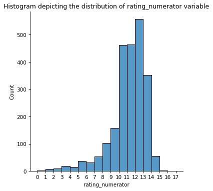
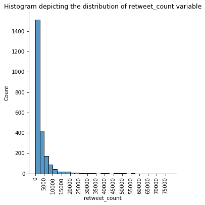
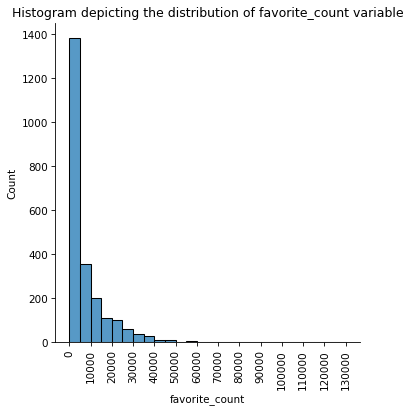
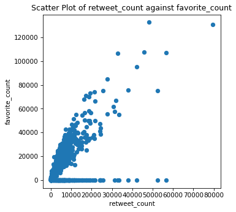
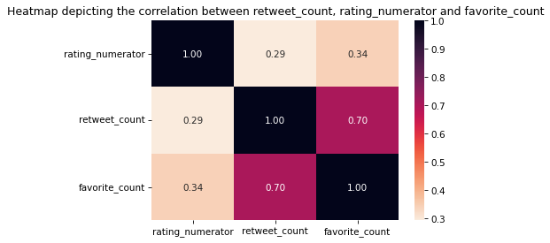

# Wrangle-and-Analyze-Data

## Reporting: wragle_report

Using both visual and programmatic assessment of twitter-archive-enhanced.csv and tweet-json.txt datasets I identified quality and tidiness issues that required cleaning to make analysis possible.
The following listing documents the issues identified along with steps taken to clean the data:
### Quality Issues
a. `twitter-archive-enhanced.csv` - missing data in the following columns(expanded_urls, retweeted_status_timestamp, retweeted_status_user_id, retweeted_status_id, in_reply_to_user_id, in_reply_to_status_id).
- I used the dataframe drop method to delete the columns with missing values in df_twitter_archive_copy.
```python
    df_twitter_archive_copy.drop(['expanded_urls', 'retweeted_status_timestamp', 'retweeted_status_user_id', 'retweeted_status_id', 'in_reply_to_user_id', 'in_reply_to_status_id'], axis='columns', inplace=True)
```


b. `twitter-archive-enhanced.csv` - timestamp column has incorrect data type of object instead of datatime data type.
- I used pandas to_datetime method to change the data type of timestamp column to datetime.
```python
   df_twitter_archive_copy['timestamp']=pd.to_datetime(df_twitter_archive_copy['timestamp'])
```


c. `twitter-archive-enhanced.csv` - 23 instances where incorrect 'rating_denominator' exist
- I extracted the text variable of each of the 23 records to determine the correct rating.
- If the rating was impossible to determine from the text then I deleted record.
- Assigning the appropriate rating_numerator & rating_denominator variables from the text variables:
```python
    #313 @jonnysun @Lin_Manuel ok jomny I know you're excited but 960/00 isn't a valid rating, 13/10 is tho
df_twitter_archive_copy.at[313, 'rating_numerator']= 13
df_twitter_archive_copy.at[313, 'rating_denominator']= 10
```
```python
#784 RT @dog_rates: After so many requests, this is Bretagne. She was the last surviving 9/11 
search dog, and our second ever 14/10. RIP https:/…
df_twitter_archive_copy.at[784, 'rating_numerator']= 14
df_twitter_archive_copy.at[784, 'rating_denominator']= 10
```
```python
#1165 Happy 4/20 from the squad! 13/10 for all https://t.co/eV1diwds8a
df_twitter_archive_copy.at[1165, 'rating_numerator']= 13
df_twitter_archive_copy.at[1165, 'rating_denominator']= 10
```
```python
#202 This is Bluebert. He just saw that both #FinalFur match ups are split 50/50. Amazed 
#af. 11/10 https://t.co/Kky1DPG4iq
df_twitter_archive_copy.at[1202, 'rating_numerator']= 11
df_twitter_archive_copy.at[1202, 'rating_denominator']= 10
```
```python
#1662 This is Darrel. He just robbed a 7/11 and is in a high speed police chase. Was 
#just spotted by the helicopter 10/10 https://t.co/7EsP8LmSp5
df_twitter_archive_copy.at[1662, 'rating_numerator']= 10
df_twitter_archive_copy.at[1662, 'rating_denominator']= 10
```
```python
#2335 This is an Albanian 3 1/2 legged  Episcopalian. Loves well-polished hardwood flooring. Penis on the collar. 9/10 https://t.co/d9NcXFKwLv
df_twitter_archive_copy.at[2335, 'rating_numerator']= 9
df_twitter_archive_copy.at[2335, 'rating_denominator']= 10
```

- Deleting records that rate_numerator variable cann't be extracted from the text variable:
```python
    df_twitter_archive_copy.drop([1843, 1663, 1635, 1634, 1598, 1433, 1351, 1274, 1254, 1228, 1120, 902, 516, 433, 342, 1068, 1779], axis='rows', inplace=True)
```


d. `twitter-archive-enhanced.csv` - 9 records had inappropriate rating_numerator variables i.e greater than 20 after correcting the rating_denominator issue.
- I deleted the 9 records with inappropriate rating_numerator variables
```python
    df_twitter_archive_copy.drop([1695, 759, 973, 188, 187, 2055, 289, 339, 691], axis='rows', inplace=True)
```


e. `twitter-archive-enhanced.csv` - some records have more than one dog stage.
Retrieve the text variables of records with more than on dog stage and determine the correct dog stage
- I retrieved the text variables of records with more than on dog stage and determined the correct dog stage
```python
    df_twitter_archive_copy[((df_twitter_archive_copy['doggo']=='doggo') & (df_twitter_archive_copy['Dog Stage'] != 'doggo'))].index
```
```python
    df_twitter_archive_copy[((df_twitter_archive_copy['floofer']=='floofer') & (df_twitter_archive_copy['Dog Stage'] != 'floofer'))].index
```
```python
    df_twitter_archive_copy[((df_twitter_archive_copy['puppo']=='puppo') & (df_twitter_archive_copy['Dog Stage'] != 'puppo'))].index
```
```python
    df_twitter_archive_copy[((df_twitter_archive_copy['pupper']=='pupper') & (df_twitter_archive_copy['Dog Stage'] != 'pupper'))].index
```

f. `tweet-json.txt` - quoted_status, quoted_status_id_str columns contain same duplicated values.
- I deleted quoted_status_id_str column
```python
    df_tweet_json_copy.drop(['quoted_status_id_str'], axis='columns', inplace=True)
```


g. `tweet-json.txt` - missing data in the following columns(in_reply_to_status_id, in_reply_to_status_id_str, in_reply_to_user_id, in_reply_to_user_id_str, in_reply_to_screen_name, user, geo, coordinates, place, contributors, quoted_status, quoted_status_id, retweeted_status, possibly_sensitive_appealable, possibly_sensitive).
- I deleted columns with missing values in tweet_json data.
```python
    df_tweet_json_copy.drop(['in_reply_to_status_id', 'in_reply_to_status_id_str', 'in_reply_to_user_id', 'in_reply_to_user_id_str', 'in_reply_to_screen_name', 'user', 'geo', 'coordinates', 'place', 'contributors', 'quoted_status', 'quoted_status_id_str',  'quoted_status_id', 'retweeted_status', 'possibly_sensitive_appealable', 'possibly_sensitive'], axis='columns', inplace=True)
```


h. `tweet-json.txt` - id, id_str columns contain same values in 1518 instances - duplicated
- I deleted id_str column in the tweet_json data.
```python
    df_tweet_json_copy.drop(['id_str'], axis='columns', inplace=True)
```


### Tidiness issues

i. `twitter-archive-enhanced.csv` - doggo, floofer, pupper, puppo are values of the 'dog stage' variable and are being used as columns.
- I created a new column 'Dog Stage' and populated it using values in doggo, floofer, pupper, puppo columns then delete doggo, floofer, pupper, puppo columns
```python
    df_twitter_archive_copy['Dog Stage'] = np.nan
    max_row = df_twitter_archive_copy.shape[0]
    for i in range(0, max_row):
        if df_twitter_archive_copy.iloc[i]['doggo'] == 'doggo':
            df_twitter_archive_copy.at[i, 'Dog Stage']= 'doggo'
        elif df_twitter_archive_copy.iloc[i]['floofer'] == 'floofer':
            df_twitter_archive_copy.at[i, 'Dog Stage']= 'floofer'
        elif df_twitter_archive_copy.iloc[i]['pupper'] == 'pupper':
            df_twitter_archive_copy.at[i, 'Dog Stage']= 'pupper'
        elif df_twitter_archive_copy.iloc[i]['puppo'] == 'puppo':
            df_twitter_archive_copy.at[i, 'Dog Stage']= 'puppo'
```
```python
    df_twitter_archive_copy.drop(['doggo', 'floofer', 'pupper', 'puppo'], axis='columns', inplace=True)
```

j. `twitter-archive-enhanced.csv and tweet-json.txt` - duplicated columns in the tables(source, in_reply_to_status_id, in_reply_to_user_id). Other columns are duplicated but have different identifiers(created_at and timestamp, full_text and text)
I deleted the duplicated columns in tweet_json data (source, in_reply_to_status_id, created_at, in_reply_to_user_id, full_text).
```python
    df_tweet_json_copy.drop(['source', 'created_at', 'full_text'], axis='columns', inplace=True)
```


## Report: act_report

### Insights Uncovored from the Analysis of Tweet_archive_master Dataset:
#### 1. Distribution of Variables of Interest
- A histogram of the rating_numerator variable depicts the data as being left skewed. Most data points lie between 10 to 13 with 12 being the most frequent rating_numerator.


- A histogram of the retweet_count variable depicts the data as being right-skewed. Most data points lie between 0 and 2500.


- A histogram of the favorite_count variable depicts the data as being right-skewed. Most data points lie between 0 and 5000.


#### 2. Relationship between Variables of interest 
- There's strong correlation between retweet_count and favorite_count variables with correlation coefficient of 0.7. A scatter plot of retweet_count against favorite_count depict most data points showcasing a linear relationship between the two variables.


      
- There's weak correlation between rating_numerator and retweet_count with correlation coefficient of 0.29 and between rating_numerator and favorite_count variables with correlation coefficient of 0.34. A scatter plot of rating_numerator against favorite_count and rating_numerator against retweet_count depict data points showcasing lack of linear relationship between the variables.




#### 3. Analysis of Image Predictions

**Most Frequent Dog Breeds**
- For the image predictions that were true dog breeds, golden_retriever, Labrador_retriever, Pembroke and Chihuahua respectively were the most frequent in the case of the first prediction.
- For the image predictions that were true dog breeds, Labrador_retriever, golden_retriever, Cardigan and Chihuahua respectively were the most frequent in the case of the second prediction.
- For the image predictions that were true dog breeds, Labrador_retriever, Chihuahua and golden_retriever respectively were the most frequent in the case of the third prediction.

**Proportion of True Dog Breeds Predictions**
- In the case of the first prediction involving dog images, only 4.73% of the predictions made were true dog breeds.
- In the case of the second prediction involving dog images, only 4.85% of the predictions made were true dog breeds.
- In the case of the third prediction involving dog images, only 4.98% of the predictions made were true dog breeds.

**Confidence Level of Predictions**
- In the case of the first prediction of dog images, 63.52% of the true dog breeds predictions made had confidence level equal to or greater than 0.5.
- In the case of the second prediction of dog images, none of the true dog breeds predictions made had confidence level equal to or greater than 0.5.
- In the case of the third prediction of dog images, also none of the true dog breeds predictions made had confidence level equal to or greater than 0.5.
